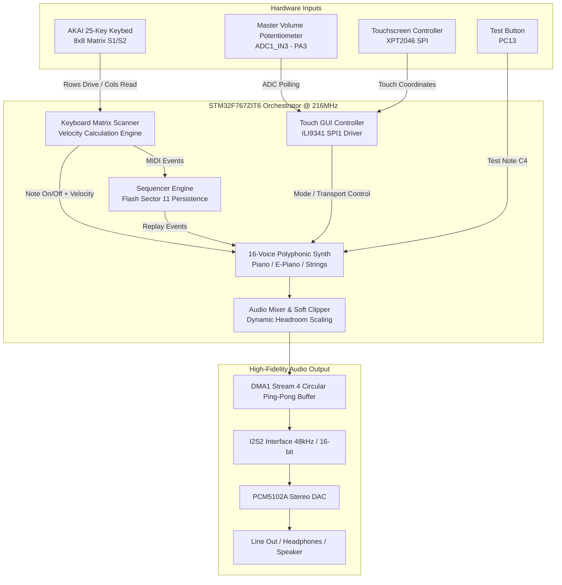

# 🎹 MAD Piano Project: AKAI MPK mini MK3 x STM32F767

<div align="center">

-002B49?style=for-the-badge&logo=stmicroelectronics)


**A high-performance, standalone polyphonic digital synthesizer, touch-controlled sequencer, and hardware controller interface built on the STM32F767ZIT6 (ARM Cortex-M7) for the AKAI MPK mini MK3.**

[Key Features](#-key-features) • [System Architecture](#-system-architecture) • [Pinout & Wiring](#-pinout--wiring-summary) • [Project Structure](#-project-directory-structure) • [Getting Started](#-getting-started) • [Documentation](#-documentation)

---

</div>

## 📖 Overview

The **MAD Piano Project** transforms the popular **AKAI MPK mini MK3** keyboard into a completely standalone musical instrument and sequencer. By replacing the computer/DAW dependency with an on-board **STM32F767ZIT6 (Nucleo-144)** microcontroller running at 216MHz, the system directly scans the physical keybed matrix, synthesizes multi-mode audio in real time, drives an interactive color touchscreen GUI, and saves recorded performances to non-volatile internal Flash memory.

---

## ✨ Key Features

- **🎹 16-Voice Polyphony & Multi-Engine:**
  - Real-time simultaneous synthesis of up to 16 notes with smooth envelope control.
  - Three distinct sound presets switchable on the fly: **Grand Piano**, **E-Piano (Electric Piano)**, and **Strings**.
- **⚡ Velocity-Sensitive 8x8 Keybed Scanning:**
  - Direct scanning of the 25-key bed matrix via Morpho **Inside Pins**.
  - Dual-contact (S1/S2) time-of-flight measurement to calculate key press velocity with millisecond precision.
- **🔊 Hi-Fi Audio Engine with Anti-Clipping:**
  - **48kHz / 16-bit Stereo Audio** delivered via **I2S2 DMA** in circular double-buffered mode to a **PCM5102A 32-bit DAC**.
  - **Dynamic Headroom Management** and **Cubic Soft-Clipping** algorithm to prevent harsh digital distortion during dense multi-voice chords.
- **💾 Persistent Flash Sequencer:**
  - 4 recording slots, each capable of storing up to **2,000 MIDI events**.
  - Automatic persistence to **Internal Flash Sector 11** (`0x081C0000`), retaining songs across power resets.
- **🖥️ Color Touchscreen Interface:**
  - 320x240 ILI9341 TFT LCD with resistive touch controller (XPT2046).
  - Features an **MP3-style music player** with progress bar, transport controls (Play/Pause/Stop), instrument selector, and live volume readout.
- **🎛️ Hardware Volume & Diagnostics:**
  - Analog master volume control via 12-bit ADC (PA3 potentiometer).
  - Blue User Button (PC13) for instant audio diagnostics (Note C4 trigger) and Red LED (LD3) for I2S DMA activity status.

---

## 🏗 System Architecture

The entire instrument pipeline runs concurrently on a single Cortex-M7 core using non-blocking DMA and hardware timers:



---

## 🔌 Pinout & Wiring Summary

All connections connect to the **STM32 Nucleo-144 Morpho Headers**.

> [!IMPORTANT]
> The Keyboard Matrix uses **Morpho Inside Pins (odd pin numbers)** exclusively to align directly with the on-board screw terminals. **Do NOT modify** the pin definitions in `keyboard_matrix.c`.

### 1. Audio DAC (PCM5102A - I2S2)
| DAC Pin | STM32 Pin | Header Pin | Description |
| :--- | :--- | :--- | :--- |
| **BCK** | **PB10** | CN10-32 (Out) | I2S2 Bit Clock |
| **DIN** | **PC3** | CN9-5 (In) | I2S2 Serial Data |
| **LCK (WS)** | **PB12** | CN7-7 (In) | I2S2 Word Select (Left/Right) |
| **SCK** | **GND** | - | Connect to GND for Internal Clock mode |
| **VCC** | **5V** | CN10-6 | Power Supply (5V recommended) |
| **GND** | **GND** | CN10-22 (In) | Common Ground |

### 2. TFT Display & Touch (ILI9341 - SPI1)
| Function | Display Pin | STM32 Pin | Header Pin | Mode |
| :--- | :--- | :--- | :--- | :--- |
| **CS** | CS | **PD14** | CN7-16 (Out) | Screen Chip Select |
| **RESET** | RESET | **PF12** | CN7-20 (Out) | Hardware Reset |
| **DC/RS** | DC/RS | **PD15** | CN7-18 (Out) | Data / Command |
| **SDI (MOSI)**| SDI | **PD7** | CN9-2 (Out) | SPI1 Master Out Slave In |
| **SCK** | SCK | **PA5** | CN7-10 (Out) | SPI1 Clock |
| **LED** | LED | **PB1** | CN10-24 (Out)| Backlight Power (High = On) |
| **SDO (MISO)**| SDO | **PA6** | CN7-12 (Out) | SPI1 Master In Slave Out |
| **T_CS** | T_CS | **PF13** | CN7-17 (In) | Touch Chip Select |
| **T_IRQ** | T_IRQ | **PF14** | CN7-15 (In) | Touch Interrupt |

### 3. Keyboard Matrix (8x8 Inside Morpho Pins)
- **Rows (Outputs - Active LOW):**
  `PC6` (CN7-1), `PB15` (CN7-3), `PB13` (CN7-5), `PA15` (CN7-9), `PC7` (CN7-11), `PB5` (CN7-13), `PB3` (CN7-15), `PA4` (CN7-17).
- **Columns (Inputs - Pull-up enabled):**
  `PB4` (CN7-19), `PC2` (CN10-9), `PF4` (CN10-11), `PB6` (CN10-13), `PB2` (CN10-15), `PD13` (CN10-19), `PD12` (CN10-21), `PD11` (CN10-23).

*For comprehensive wiring diagrams and terminal pin mappings, refer to [docs/PINOUT.md](docs/PINOUT.md) and [docs/WIRING.md](docs/WIRING.md).*

---

## 📂 Project Directory Structure

```
MAD_Piano_Project/
├── .gitignore                      # Git ignore rules for build artifacts and IDEs
├── .project / .cproject / .mxproject# STM32CubeIDE Eclipse project descriptors
├── ProjectPiano.ioc                # STM32CubeMX hardware configuration model
├── STM32F767ZITX_FLASH.ld          # GNU linker script for Flash execution
├── STM32F767ZITX_RAM.ld            # Linker script for RAM execution
├── LICENSE                         # MIT License
├── README.md                       # Main project documentation (this file)
├── GEMINI.md                       # Project rules, architecture mandates & roadmap
├── AGENTS.md                       # Developer & agent session guidelines
│
├── Core/                           # Application Source Code
│   ├── Inc/                        # Header files
│   │   ├── audio_engine.h          # 16-voice polyphonic synthesizer & soft-clipper
│   │   ├── keyboard_matrix.h       # 8x8 matrix scanning & velocity engine
│   │   ├── keyboard_handler.h      # Matrix event to MIDI note mapper
│   │   ├── sequencer.h             # 4-slot song recorder & Flash persistence
│   │   ├── tft_driver.h            # ILI9341 LCD hardware driver
│   │   ├── tft_gfx.h               # Graphics primitive rendering
│   │   ├── touch_driver.h          # XPT2046 touch controller interface
│   │   ├── ui_controller.h         # Graphical interface & state machine
│   │   ├── main.h                  # Pin definitions & peripheral prototypes
│   │   ├── stm32f7xx_hal_conf.h    # HAL driver configuration
│   │   └── stm32f7xx_it.h          # Interrupt handler prototypes
│   ├── Src/                        # Implementation files
│   │   ├── audio_engine.c          # DSP synthesis & soft-clipping math
│   │   ├── keyboard_matrix.c       # Low-level matrix scan with pull-up GPIO
│   │   ├── keyboard_handler.c      # Key event dispatcher
│   │   ├── sequencer.c             # Sequencer engine with Flash Sector 11 I/O
│   │   ├── tft_driver.c            # SPI display write routines
│   │   ├── tft_gfx.c               # Text and shape drawing routines
│   │   ├── touch_driver.c          # Touch coordinate sampling & calibration
│   │   ├── ui_controller.c         # Screen renderers (Player, Synth, Settings)
│   │   ├── main.c                  # Main orchestration loop & peripheral inits
│   │   ├── stm32f7xx_hal_msp.c     # HAL MSP peripheral initialization
│   │   ├── stm32f7xx_it.c          # Interrupt service routines (DMA, SysTick)
│   │   ├── system_stm32f7xx.c      # Clock & system setup (216MHz)
│   │   ├── syscalls.c              # Minimal system calls for newlib
│   │   └── sysmem.c                # Dynamic memory management
│   └── Startup/
│       └── startup_stm32f767zitx.s # ARM Cortex-M7 vector table & startup
│
├── Drivers/                        # Vendor Libraries
│   ├── CMSIS/                      # ARM Cortex-M7 CMSIS Core & Device headers
│   └── STM32F7xx_HAL_Driver/       # ST Microelectronics Hardware Abstraction Layer
│
└── docs/                           # Detailed Technical Documentation
    ├── ARCHITECTURE.md             # In-depth system architecture & DSP formulas
    ├── PINOUT.md                   # Full hardware pinout tables and Morpho map
    ├── WIRING.md                   # Hardware wiring schematics and connection guide
    └── INTERRUPTS.md               # Interrupt routines and peripheral timing guide
```

---

## 🚀 Getting Started

### Prerequisites
- **Hardware:**
  - STM32 Nucleo-F767ZI development board
  - PCM5102A I2S DAC Module
  - ILI9341 3.2" TFT LCD with XPT2046 Touch Screen (SPI)
  - AKAI MPK mini MK3 Keybed (or equivalent 8x8 matrix)
  - 10kΩ Potentiometer (for Master Volume)
- **Software:**
  - [STM32CubeIDE](https://www.st.com/en/development-tools/stm32cubeide.html) (Version 1.14.0 or newer recommended)
  - ST-LINK Utility or STM32CubeProgrammer

### Build & Flash Instructions
1. **Clone the Repository:**
   ```bash
   git clone https://github.com/KNIGHTKRUBPOM/MAD_Piano_Project.git
   cd MAD_Piano_Project
   ```
2. **Open in STM32CubeIDE:**
   - Launch STM32CubeIDE.
   - Select **File > Open Projects from File System...**
   - Click **Directory...**, choose the cloned repository folder, and click **Finish**.
3. **Hardware Verification:**
   - Verify all Morpho inside pin connections against [docs/PINOUT.md](docs/PINOUT.md).
   - Ensure the DAC is powered and BCK, DIN, LCK signals are correctly seated.
4. **Compile & Program:**
   - Build the project (**Project > Build Project** or `Ctrl+B`).
   - Connect the STM32 board via USB to the ST-LINK port.
   - Click **Run > Debug** (or `F11`) to flash the firmware into the MCU.
5. **Quick Verification:**
   - Press the onboard **Blue Button (PC13)**: The system plays a test note C4.
   - Verify the **Red LED (LD3)** is active, indicating continuous I2S DMA streaming.

---

## 📚 Documentation

Detailed engineering references can be found in the [`docs/`](docs/) directory:
- [System Architecture (docs/ARCHITECTURE.md)](docs/ARCHITECTURE.md) - Deep dive into DSP algorithms, cubic soft clipper, and Flash layout.
- [Hardware Pinout (docs/PINOUT.md)](docs/PINOUT.md) - Complete pin mapping for Nucleo-144 Morpho headers.
- [Wiring Guide (docs/WIRING.md)](docs/WIRING.md) - Detailed wiring schematics and screw-terminal assignments.
- [Interrupt & Peripherals (docs/INTERRUPTS.md)](docs/INTERRUPTS.md) - Explanation of ISRs, double buffering, and timing.

---

## 📄 License

This project is licensed under the [MIT License](LICENSE).
