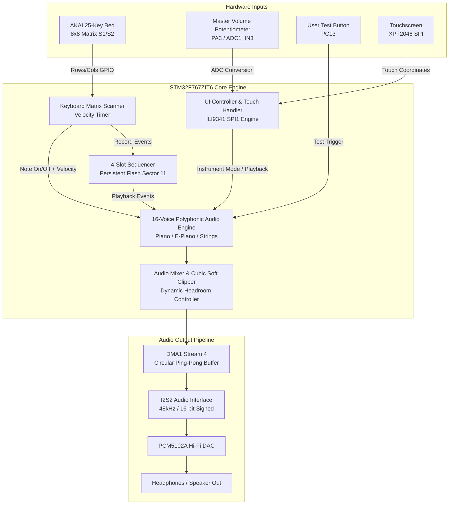

# 🏛️ System Architecture - MAD Piano Project

Detailed software and hardware architecture documentation for the **MAD Piano Project (AKAI MPK mini MK3 x STM32F767 Standalone)**.

---

## 1. System Overview

The **MAD Piano Project** turns the AKAI MPK mini MK3 keybed and controller into an independent, all-in-one musical instrument. By running all matrix scanning, DSP audio synthesis, flash persistence, and touch UI orchestration directly on a single **STM32F767ZIT6 (Cortex-M7 @ 216MHz)**, the system achieves sub-millisecond responsiveness with zero external computer dependency.



---

## 2. Hardware Layer Specifications

| Component | Model / Spec | Interface | Role / Description |
| :--- | :--- | :--- | :--- |
| **MCU** | STM32F767ZIT6 (Nucleo-144) | On-chip | 216MHz ARM Cortex-M7, 2MB Flash, 512KB SRAM, Hardware FPU & DSP instructions |
| **Audio DAC** | PCM5102A Module | I2S2 (SPI2) + DMA1 | 32-bit / 384kHz capable stereo DAC, operating in 48kHz / 16-bit mode |
| **Display & Touch**| ILI9341 3.2" TFT (320x240) + XPT2046 | SPI1 (6.75MHz) + Bit-banged Touch | Color GUI, real-time waveform display, song player, and mode switcher |
| **Keyboard Input**| AKAI MPK mini MK3 Keybed | 8x8 Matrix (GPIO Inside Pins) | 25 keys scanned using dual-switch (S1/S2) contacts for velocity calculation |
| **Analog Input** | 10kΩ Linear Potentiometer | ADC1 Channel 3 (PA3) | Master volume level adjustment (0 to 100%) |
| **Debug & Logs** | ST-LINK V2-1 VCP | USART3 (PD8/PD9, 115200 bps) | System diagnostics, note event logs, flash write confirmations |

---

## 3. Audio Pipeline & Real-Time DSP

### 3.1 Double-Buffering DMA Architecture
Audio data is continuously streamed using **I2S2 in Circular DMA Mode** with an internal ping-pong buffer:
- **Buffer Size:** `AUDIO_BUF_SIZE = 1024` words (512 stereo frames).
- **Ping-Pong Callbacks:**
  - `HAL_I2S_TxHalfCpltCallback`: Triggers calculation for the first half of the buffer (index `0` to `511`).
  - `HAL_I2S_TxCpltCallback`: Triggers calculation for the second half of the buffer (index `512` to `1023`).
- **Timing Constraint:** At 48kHz stereo, half a buffer (256 stereo samples) takes ~5.33ms to play. The DSP calculation completes in < 1.2ms, leaving over 75% CPU headroom for GUI, matrix scanning, and sequencer processing.

### 3.2 16-Voice Polyphony & Wave Synthesis
The engine supports up to **16 simultaneous voices** with dynamic voice allocation and note stealing:
1. **GRAND PIANO:** Additive harmonic synthesis with natural acoustic exponential decay and per-key velocity curve.
2. **E-PIANO (Electric Piano):** Bell-like FM-style harmonic richness with subtle vibrato and sustained body.
3. **STRINGS:** Dual detuned sawtooth waveforms with slow attack and sustained chorus-like texture.

### 3.3 Dynamic Headroom & Cubic Soft-Clipping
When playing large multi-finger chords (e.g., 6–10 voices simultaneously), standard linear summing causes harsh digital clipping. Project Piano resolves this with two integrated mechanisms:
1. **Dynamic Headroom Attenuation:** Summed voice amplitude is scaled inversely proportional to the number of active voices:
   $$\text{Gain} = \frac{1}{\sqrt{\max(1, N_{\text{voices}})}}$$
2. **Cubic Soft-Clipper:** Any sample exceeding the linear threshold ($\pm 24,000$ in 16-bit range) is smoothly saturated via cubic curve:
   $$y = x - \frac{1}{3} \left(\frac{x - T}{1 - T}\right)^3$$
   This eliminates harsh square-wave distortion and maintains acoustic warmth even during high-velocity fortissimo chords.

---

## 4. 8x8 Keyboard Matrix & Velocity Engine

The AKAI MPK mini MK3 uses a dual-rubber-dome switch configuration per key:
- **S1 Contact (Row Even):** Engages first when a key starts travelling downwards.
- **S2 Contact (Row Odd):** Engages at the bottom of the key travel.

### Scanning Algorithm
1. Rows are connected to Morpho **Inside Pins** (odd-numbered pins) and driven **LOW** sequentially.
2. Columns are configured with internal **Pull-Up Resistors** and sampled when each row is active.
3. When **S1** triggers, an internal high-resolution timer records timestamp $t_1$.
4. When **S2** triggers, timestamp $t_2$ is recorded.
5. Key travel duration $\Delta t = t_2 - t_1$ determines velocity:
   $$\text{Velocity} = \text{clamp}\left(127 - \frac{\Delta t - \Delta t_{\min}}{\Delta t_{\max} - \Delta t_{\min}} \times 127, 1, 127\right)$$
   Fast keystrokes yield high velocity (up to 127); gentle presses yield soft velocity.

---

## 5. Sequencer & Flash Memory Layout

The built-in sequencer provides 4 memory slots to record and replay live performances without external equipment.

### Flash Memory Allocation (Sector 11)
- **Base Address:** `0x081C0000` (Sector 11, 256 KB)
- **Data Retention:** Non-volatile internal Flash storage across power cycles.
- **Slot Capacity:** 4 independent slots, each holding up to **2,000 MIDI events**.

```
Memory Map (Sector 11 - 256 KB):
+-------------------------+-----------------------------------------+
| Address Range           | Content                                 |
+-------------------------+-----------------------------------------+
| 0x081C0000 - 0x081C001F | Magic Header ("PIANO_SEQ") & Slot Table |
| 0x081C0020 - 0x081CEFFF | Slot 1 Events (2,000 events x 16 bytes) |
| 0x081CF000 - 0x081DDFFF | Slot 2 Events (2,000 events x 16 bytes) |
| 0x081DE000 - 0x081ECFFF | Slot 3 Events (2,000 events x 16 bytes) |
| 0x081ED000 - 0x081FBFFF | Slot 4 Events (2,000 events x 16 bytes) |
| 0x081FC000 - 0x081FFFFF | System Settings & Calibration Data      |
+-------------------------+-----------------------------------------+
```

---

## 6. Graphical User Interface (GUI) & Touch Engine

- **Driver:** Hardware SPI1 configured at **6.75MHz** (Prescaler 32) ensuring reliable touch controller communication without bus conflicts.
- **Display Resolution:** 320x240 pixels, landscape orientation.
- **UI Screens:**
  1. **Synthesizer Screen:** Real-time note visualizer, active sound engine indicator, master volume bar.
  2. **MP3-Style Player:** Track title, interactive Play / Pause / Stop buttons, dynamic playback progress bar.
  3. **Settings & Calibration:** Touch screen alignment and hardware test panel.
